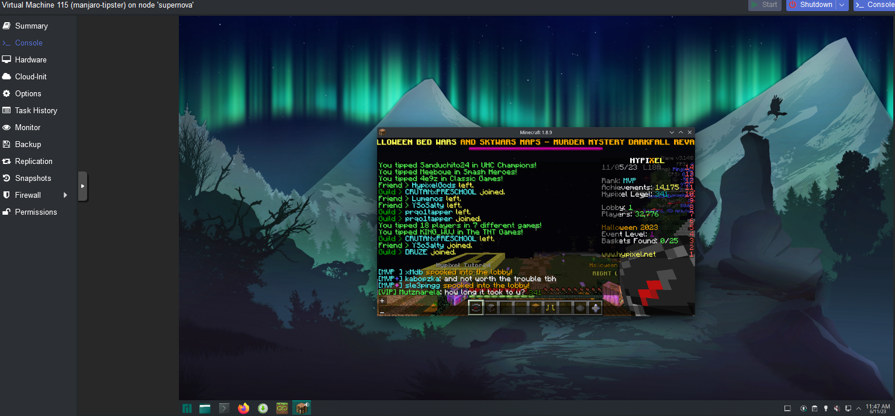
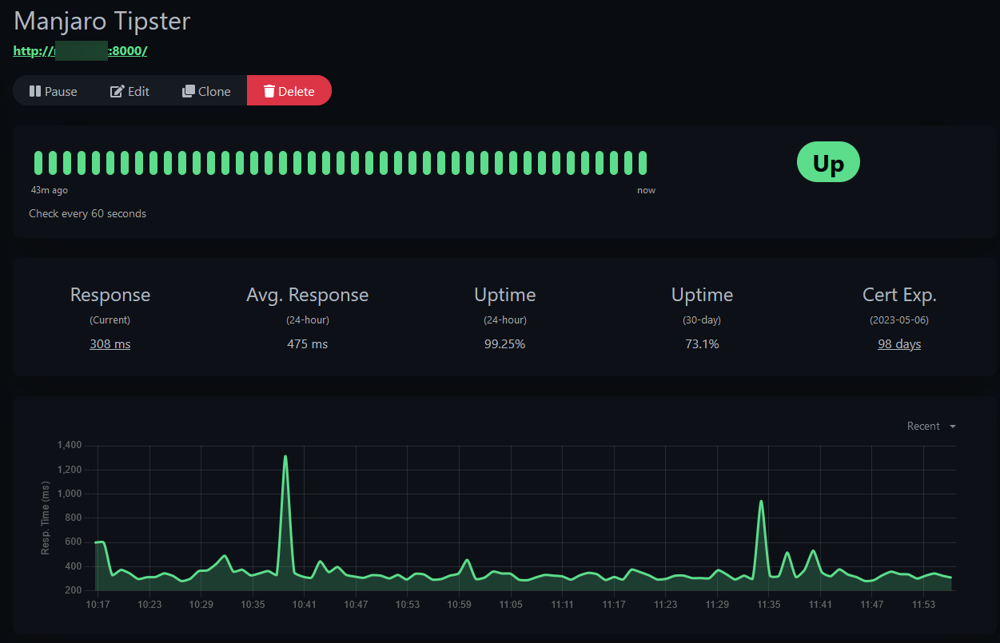

# oncheck: Hypixel Online Detector and HTTP Server

This is a simple script that checks if a player is online on Hypixel and provides HTTP codes 200 or 500. This is done by using the [Hypixel API](https://api.hypixel.net).

If the player is online, HTTP 200 is returned along with the text, "Username is online".

If the player is offline, HTTP 500 is returned along with the text, "Username is offline".

I use this with Uptime Kuma to monitor if my VM called Majaro Tipster is working.



## Usage

Put your Minecraft UUID and Hypixel API key in `.env.example` and rename it to `.env`.

Then, run it using `python3 main.py`.

After, you can add the URL to Uptime Kuma.



## Integrate with systemd

You can integrate this with systemd to run it as a service.

Create a file called `oncheck.service` in `/etc/systemd/system/` and put the following in it:

```ini
[Unit]
Description=Oncheck Online Detector

[Service]
User=USERNAME
ExecStart=/usr/bin/python3 /path/to/oncheck/main.py
Restart=always

[Install]
WantedBy=multi-user.target
```

Then, run `sudo systemctl daemon-reload` and `sudo systemctl enable oncheck.service`.

You can then start it using `sudo systemctl start oncheck.service`.

Afterwards, check the status using `sudo systemctl status oncheck.service`. You should see it running.

## License

This project is licensed under the MIT License - see the [LICENSE](LICENSE) file for details.
